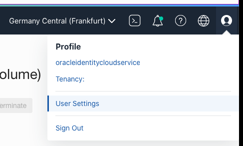
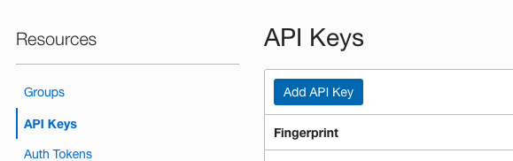
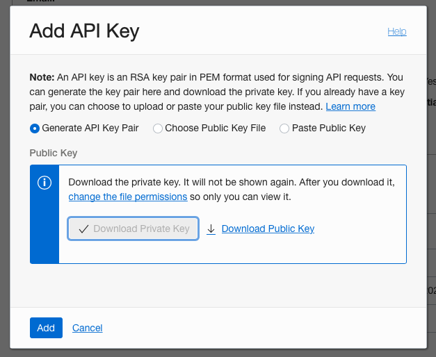
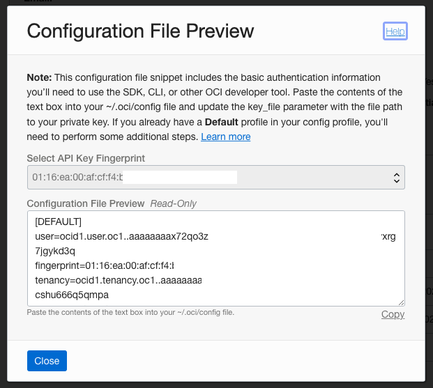
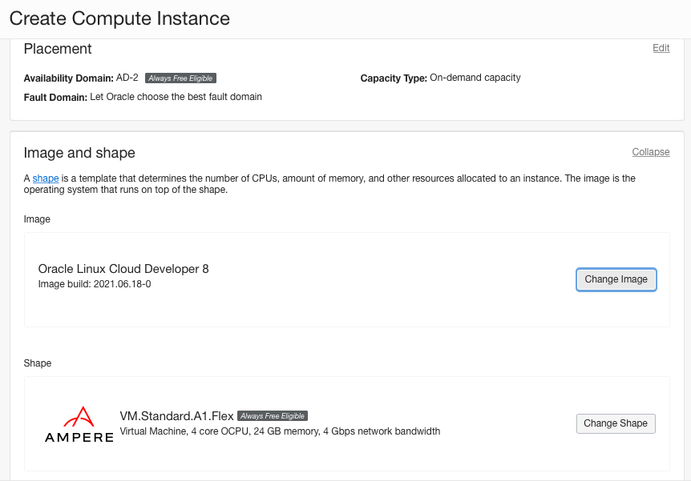
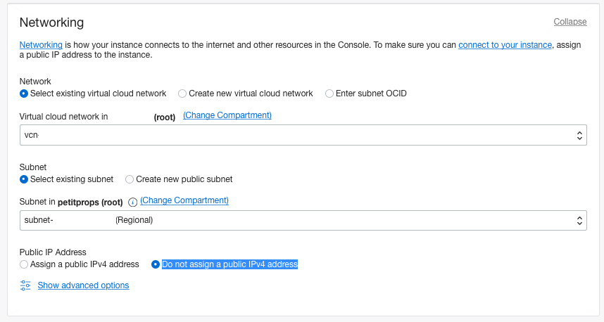
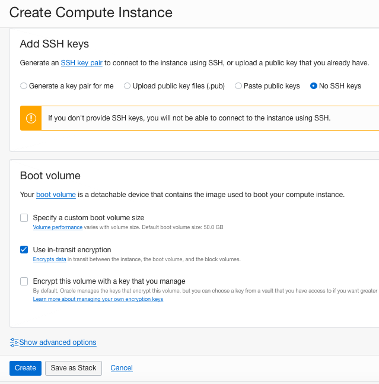
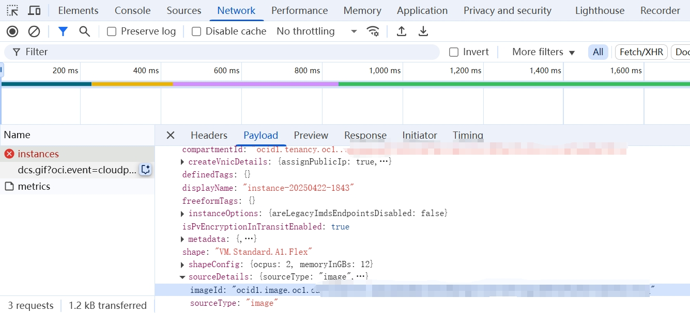

# Resolving Oracle Cloud "Out of Capacity" issue

This repository contains Terraform configurations and scripts to automate the provisioning of ARM-based instances on Oracle Cloud Infrastructure (OCI).

> **Notice**: While this script remains fully functional, many users now recommend upgrading to Pay As You Go (PAYG) for the best experience. With PAYG, you'll continue to enjoy all the free benefits without any additional cost, but you'll also receive priority for launching instances and are less likely to face "Out of host capacity" errors. Additionally, PAYG unlocks more types of OCI resources, including free Kubernetes-related infrastructure. It's important to set up budget alerts as a safety net and be mindful of the resources you deploy and their associated costs. This way, you can take full advantage of PAYG while keeping your spending in check.

## About This Project

Oracle Cloud Infrastructure (OCI) offers a very useful ARM configuration as part of its Always Free tier accoring to its [announcement](https://blogs.oracle.com/cloud-infrastructure/post/moving-to-ampere-a1-compute-instances-on-oracle-cloud-infrastructure-oci). Each tenancy gets the first 3,000 OCPU hours and 18,000 GB hours per month for free to create Ampere A1 Compute instances using the VM.Standard.A1.Flex shape (equivalent to 4 OCPUs and 24 GB of memory).

However, these resources are extremely scarce and difficult to secure for free tier users due to the frequent "Out of Capacity" error. This project was created to solve this problem by:

- Automatically monitoring for available ARM capacity on OCI
- Implementing intelligent retry mechanisms when facing "out of capacity" errors
- Reducing manual effort in repeatedly checking for and claiming free ARM resources

With this tool, you can let the script run in the background and automatically provision an ARM instance as soon as capacity in your region becomes available, rather than manually checking and facing disappointment.

## Tech Stack

<p align="center">
  
</p>

This project uses *Terraform*, HashiCorp's infrastructure as code (IaC) tool that allows the definition of resources and infrastructure in human-readable configuration files. Terraform enables the safe building, changing, and versioning of cloud infrastructure. It automates the provisioning process by codifying cloud APIs into declarative configuration files, allowing for consistent deployment and easy tracking of infrastructure changes.

## How to Use

The overall process is simple and consists of just three steps:

1. Clone this repository to your Ubuntu machine:
   ```bash
   git clone https://github.com/yourusername/my-oci-arm-host-capacity.git
   cd my-oci-host-capcity
   ```

2. Configure the `terraform.tfvars` file with your OCI credentials and instance settings (detailed below)

3. Run the provisioning script:
   ```bash
   bash run_terraform.sh
   ```

## Configuration Guide

The most important part is configuring the variables in `terraform.tfvars`. Follow these steps carefully to obtain all required information.

> **Important**: Never commit or share your `terraform.tfvars` file as it contains sensitive credentials.

### Step 1: Generate OCI API Keys

API keys are credentials that allow you to interact with the OCI API. These keys grant programmatic access to your OCI resources, enabling automation tools like Terraform to create and manage infrastructure on your behalf. You'll need to generate these keys to authenticate your requests to the OCI API.

From the process below, you'll obtain these values for your `.tfvars` file:
- `tenancy_ocid`: Your tenancy OCID 
- `user_ocid`: Your user OCID
- `fingerprint`: The API key fingerprint
- `private_key_path`: Path where you saved your private key (e.g., `/home/user/.oci/oci_api_key.pem`)
- `region`: Your preferred OCI region (e.g., `ap-tokyo-1`)

1. Log in to the [OCI Console](https://cloud.oracle.com)

2. After logging in to OCI Console, click profile icon and then "User Settings"



3. Go to Resources -> API keys, click "Add API Key" button



4. Make sure "Generate API Key Pair" radio button is selected, click "Download Private Key" and then "Add".



5. Copy the contents from textarea and extract corresponding value and save to .tfvars file with same key name. Save private key file (*.pem file) to the directory of the host that you want execute the script via SFTP or other method. For example, put the *.pem file in a newly created directory /home/ubuntu/.oci



### Step 2: Gather Instance Configuration Details

Go through the instance creation process in the OCI web console (without actually creating it) to gather these parameters:

- `subnet_id`: OCID of the subnet where your instance will be created (found in Networking → Virtual Cloud Networks → [Your VCN] → Subnets)
- `source_id`: OCID of the OS image (found in Compute → Instances → Create Instance → Image)
- `ocups`: Number of OCPUs for your ARM instance (typically 2-4 for free tier)
- `memory_in_gbs`: RAM amount in GB (typically 12-24 for free tier)
- `boot_volume_size_in_gbs`: Boot volume size in GB (minimum 50)
- `ssh_authorized_keys`: Your public SSH key content for accessing the instance (note: this is the content of the key, not the path to .pub file)

Follow these steps:

1. Start instance creation process from the OCI Console in the browser (Menu -> Compute -> Instances -> Create Instance)

2. Change image and shape. For Always free ARM - make sure that "Always Free Eligible" availabilityDomain label is there:



3. Note that ARMs can be created anywhere within your home region.

4. Adjust Networking section, set "Do not assign a public IPv4 address" checkbox. If you don't have existing VNIC/subnet, please create an instance with subnet before doing everything.



5. The "Add SSH keys" section does not matter for us right now. Before clicking "Create"...



6. Open browser's dev tools -> network tab. Click "Create" and wait a bit. Most probably you'll get "Out of capacity" error. Now find /instances API call (red one)...



7. Right click on it -> copy as curl. Paste the clipboard contents in any text editor and review the data-binary parameter. Find subnet_id, image_id (as source_id) respectively.

#### SSH Key Configuration

In order to have secure shell (SSH) access to the instance you need to have a keypair, basically 2 files:
- `~/.ssh/id_rsa`
- `~/.ssh/id_rsa.pub`

The public key contents (string) should be provided in the terraform.tfvars file. There are plenty of tutorials on how to generate SSH keys if you don't have them yet.

To view your public key:
```bash
cat ~/.ssh/id_rsa.pub
```

The output should be similar to:
```
ssh-ed25519 AAAAC3NzaC1lZDI1NTE5AAAAIFwZVQa+F41Jrb4X+p9gFMrrcAqh9ks8ATrcGRitK+R/ github.com@dunyu.com
```

Set the `ssh_authorized_keys` value in your terraform.tfvars file to this string (or you won't be able to login into the newly created instance). No new lines allowed!

#### Resource Configuration

- `ocpus` and `memory_in_gbs` are set to 4 and 24 by default. You can safely adjust them.
- Possible values are 1/6, 2/12, 3/18 and 4/24, respectively.
- Note that the "Oracle Linux Cloud Developer" image can be created with at least 8GB of RAM (memory_in_gbs).

If for some reason your home region is running out of Always Free ARM capacity (total 4 OCPU + 24GB RAM), the script will report an error and exit.


